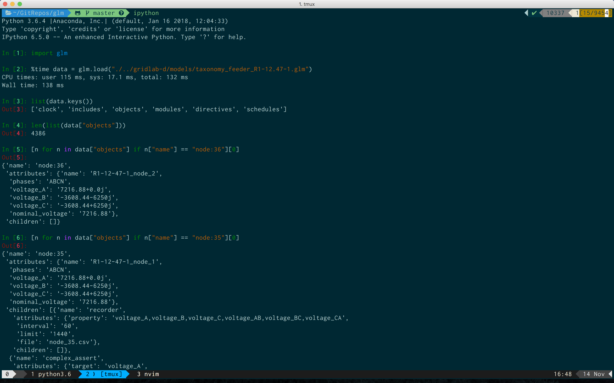
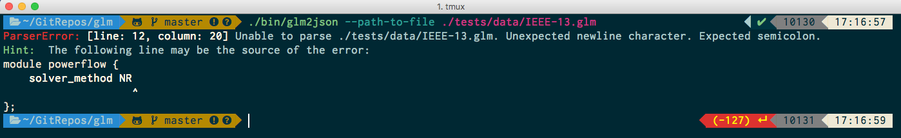

# glm [](https://travis-ci.com/NREL/glm)

A fast [GridLAB-D](https://github.com/gridlab-d/gridlab-d) to JSON (and back) parser.

- Fast GLM to JSON converter.
    - Supports nested objects, schedules, definitions, directives, modules, includes and clock objects
- Fast JSON to GLM converter.
- Native support for Python, returns nested dictionaries.



- Descriptive error messages when unable to parse a GridLAB-D model file.



- Tested on all examples in the GridLAB-D source repository.

## Install

Go to the [latest releases page](https://github.com/NREL/glm/releases/latest) for the Python or the CLI for various operating systems.

### Python

You can pip install the package from PyPI or using the wheel (files with extension .whl) after downloading it or directly from the URL from the releases page.

For example, the following installs the latest glm package for Windows, MacOSX or Linux. This will work for Python2 or Python3.

```
pip install glm
```

### CLI

Alternatively, if you want to use the CLI, you can unzip the file from the releases page for your operating system.
There will be two executables in the folder, `glm2json` and `json2glm`.
On Windows, you may have to rename the files to add the `.exe` at the end of the executable in order to run it from a Windows CMD prompt.
You will be able to run it from a Git Bash prompt without renaming it.
You can use the following commands to download and unzip the files on the respective operating systems.

**Windows**

```
export VERSION=$(curl -s "https://github.com/NREL/glm/releases/latest" | grep -o 'tag/[v.0-9]*' | awk -F/ '{print $2}')
curl -LO "https://github.com/NREL/glm/releases/download/$VERSION/glm-windows-amd64.zip"
unzip glm-windows-amd64.zip
```

**OSX**

```
export VERSION=$(curl -s "https://github.com/NREL/glm/releases/latest" | grep -o 'tag/[v.0-9]*' | awk -F/ '{print $2}')
curl -LO "https://github.com/NREL/glm/releases/download/$VERSION/glm-osx-amd64.tar.xz"
tar -zxvf glm-osx-amd64.tar.xz
```

**Linux**

```
export VERSION=$(curl -s "https://github.com/NREL/glm/releases/latest" | grep -o 'tag/[v.0-9]*' | awk -F/ '{print $2}')
curl -LO "https://github.com/NREL/glm/releases/download/$VERSION/glm-linux-amd64.tar.xz"
tar -zxvf glm-linux-amd64.tar.xz
```

The contents of the compressed archive will contain a command line executable, and a module that can be imported into Python.

## Documentation

You can use this from the command line as follows:

```
Usage:
  glm2json [required&optional-params]
Convert from glm/json to json/glm
  Options(opt-arg sep :|=|spc):
  -h, --help                            write this help to stdout
  --version           bool    false     write version to stdout
  -p=, --pathToFile=  string  REQUIRED  set pathToFile
  --pretty            bool    false     set pretty
```

```
./glm2json --path-to-file ./tests/data/4node.glm --pretty                                                                                                                            ✔  10397  18:20:47
{
  "clock": {
    "timestamp": "2000-01-01 0:00:00",
    "timezone": "EST+5EDT"
  },
  "includes": [],
  "objects": [
    {
      "name": "overhead_line_conductor:100",
      "attributes": {
        "name": "PhaseCond",
        "geometric_mean_radius": "0.0244 ft",
        "resistance": "0.306"
      },
      "children": []
    },
    {
      "name": "overhead_line_conductor:101",
      "attributes": {
        "name": "NeutralCond",
        "geometric_mean_radius": "0.00814 ft",
        "resistance": "0.592"
      },
      "children": []
    },
    {
      "name": "line_spacing:200",
      "attributes": {
        "name": "LineSpacing",
        "distance_AB": "2.5",
        "distance_BC": "4.5",
        "distance_AC": "7.0",
        "distance_AN": "5.656",
        "distance_BN": "4.272",
        "distance_CN": "5.0"
      },
      "children": []
    },
    {
      "name": "line_configuration:1",
      "attributes": {
        "name": "LineConf",
        "conductor_A": "PhaseCond",
        "conductor_B": "PhaseCond",
        "conductor_C": "PhaseCond",
        "conductor_N": "NeutralCond",
        "spacing": "LineSpacing"
      },
      "children": []
    },
    {
      "name": "overhead_line",
      "attributes": {
        "name": "Line1",
        "phases": "ABCN",
        "from": "Node1",
        "to": "Node2",
        "length": "2000 ft",
        "configuration": "LineConf",
        "nominal_voltage": "124.0"
      },
      "children": []
    },
    {
      "name": "overhead_line",
      "attributes": {
        "name": "Line2",
        "phases": "ABCN",
        "from": "Node3",
        "to": "Node4",
        "length": "2500 ft",
        "configuration": "LineConf",
        "nominal_voltage": "124.0"
      },
      "children": []
    },
    {
      "name": "node",
      "attributes": {
        "name": "Node1",
        "phases": "ABCN",
        "nominal_voltage": "124.0"
      },
      "children": []
    },
    {
      "name": "node",
      "attributes": {
        "name": "Node2",
        "phases": "ABCN",
        "nominal_voltage": "124.0"
      },
      "children": []
    },
    {
      "name": "node",
      "attributes": {
        "name": "Node3",
        "phases": "ABCN",
        "nominal_voltage": "124.0"
      },
      "children": []
    },
    {
      "name": "node",
      "attributes": {
        "name": "Node4",
        "phases": "ABCN",
        "nominal_voltage": "124.0"
      },
      "children": []
    },
    {
      "name": "tape.recorder",
      "attributes": {
        "interval": "4.0",
        "parent": "network_node2",
        "limit": "21600",
        "file": "./csv_output/network_node2.csv",
        "property": "measured_real_power, measured_real_energy, voltage_A, voltage_B, voltage_C"
      },
      "children": []
    }
  ],
  "modules": [
    {
      "name": "powerflow",
      "attributes": {}
    },
    {
      "name": "tape",
      "attributes": {}
    }
  ],
  "directives": [],
  "definitions": [],
  "schedules": []
}
```

## Issues

Feel free to open an issue if something is not working as expected.


## Developer Guide

- Install [Nim](https://nim-lang.org/install.html)
- Run `nimble install -y` to generate binaries

If you want to install the latest version from GitHub, you can use the following commands.
The GitHub release is identical to that on PyPI.

**Windows**

```
export VERSION=$(curl -s "https://github.com/NREL/glm/releases/latest" | grep -o 'tag/[v.0-9]*' | awk -F/ '{print $2}')
pip install https://github.com/NREL/glm/releases/download/$VERSION/glm-${VERSION#"v"}-py2.py3-none-win_amd64.whl
```

**OSX**

```
export VERSION=$(curl -s "https://github.com/NREL/glm/releases/latest" | grep -o 'tag/[v.0-9]*' | awk -F/ '{print $2}')
pip install https://github.com/NREL/glm/releases/download/$VERSION/glm-${VERSION#"v"}-py2.py3-none-macosx_10_7_x86_64.whl
```

**Linux**

```
export VERSION=$(curl -s "https://github.com/NREL/glm/releases/latest" | grep -o 'tag/[v.0-9]*' | awk -F/ '{print $2}')
pip install https://github.com/NREL/glm/releases/download/$VERSION/glm-${VERSION#"v"}-py2.py3-none-manylinux1_x86_64.whl
```

